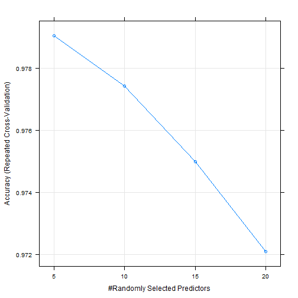
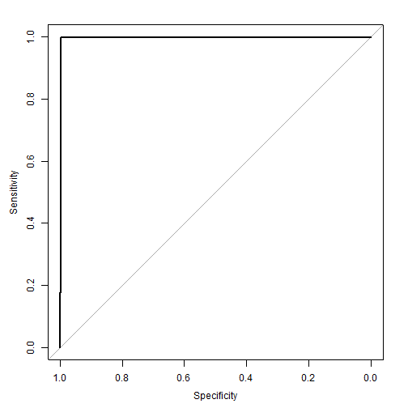
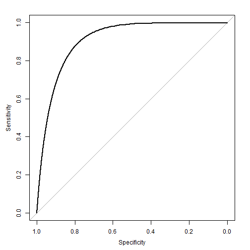
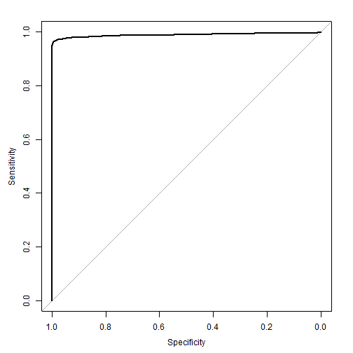
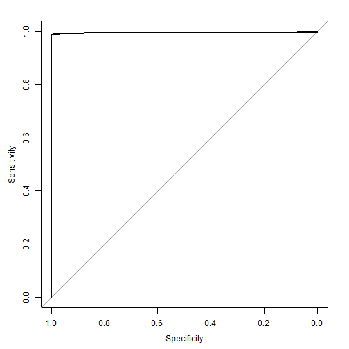

# Title - Weight Lifting Exercises Prediction
## Synopsis
The goal of this project is to predict the manner in which participants did the
exercise. This is the "classe" variable in the training set. Predictive models
may use any of the other variables. The final output is a report describing how
the model was constructed, how cross validation was used, the expected out of
sample error, and why various choices were made. The model will also be used to
predict 20 different test cases. 

Using a Random Forest model with each tree consisting of five randomly chosen
features, I was able to obtain an average accuracy of 98% on an out-of-sample
test set.  The model was built using 10 repetitions of 10-fold cross validation
against 80% of the original training data, and then validated against tested
against an out-of-sample validation set consisting of the remaining 20% of the
original training data.

The model allowed me to correctly predict the classification of 19 of the 20
examples submitted as part of this assignment.

## Model Building
This exercise is an example of a classification problem.  (As opposed to a
regression problem.)  Rather than predicting a continuous variable (regression),
we are predicting a categorical variable.  Specifically, we are attempting to
predict the result of a weight lifting exercise.  In this case, the result is
one of the following five classifications: exactly according to the
specification (Class A), throwing the elbows to the front (Class B), lifting the
dumbbell only halfway (Class C), lowering the dumbbell only halfway (Class D)
and throwing the hips to the front (Class E).

### Set defaults
Set knitr to echo code by default

```r
#~~~~~~~~~~~~~~~~~~~~~~~~~~~~~~~~~~~~~~~~~~~~~~~~~~~~~~~~~~~~~~~~~~~~~~~~~~~~~~~
# Set echo=TRUE by default
#~~~~~~~~~~~~~~~~~~~~~~~~~~~~~~~~~~~~~~~~~~~~~~~~~~~~~~~~~~~~~~~~~~~~~~~~~~~~~~~
library(knitr)
opts_chunk$set(echo = TRUE)
```

### Prepare the environment

```r
#~~~~~~~~~~~~~~~~~~~~~~~~~~~~~~~~~~~~~~~~~~~~~~~~~~~~~~~~~~~~~~~~~~~~~~~~~~~~~~~
# Import required libraries
#~~~~~~~~~~~~~~~~~~~~~~~~~~~~~~~~~~~~~~~~~~~~~~~~~~~~~~~~~~~~~~~~~~~~~~~~~~~~~~~
suppressMessages(library(ggplot2))     # General plotting functions
suppressMessages(library(plyr))        # Data manipulation
suppressMessages(library(dplyr))       # Data manipulation
suppressMessages(library(gridExtra))   # Grid layout for ggplot2 graphs
suppressMessages(library(scales))      # Axis scaling for ggplot2 graphs
suppressMessages(library(caret))       # Machine learning
suppressMessages(library(doParallel))  # Multicore processing
suppressMessages(library(pROC))        # Model performance measurement

## ~~~~~~~~~~~~~~~~~~~~~~~~~~~~~~~~~~~~~~~~~~~~~~~~~~~~~~~~~~~~~~~~~~~~~~~~~~~~~
## Register parallel backend
## ~~~~~~~~~~~~~~~~~~~~~~~~~~~~~~~~~~~~~~~~~~~~~~~~~~~~~~~~~~~~~~~~~~~~~~~~~~~~~
cl <- makeCluster(4)  # set appropriately for server on which job will run
registerDoParallel(cl)

#~~~~~~~~~~~~~~~~~~~~~~~~~~~~~~~~~~~~~~~~~~~~~~~~~~~~~~~~~~~~~~~~~~~~~~~~~~~~~~~
# Set paths for files and directory structure
#~~~~~~~~~~~~~~~~~~~~~~~~~~~~~~~~~~~~~~~~~~~~~~~~~~~~~~~~~~~~~~~~~~~~~~~~~~~~~~~
## Get the local path
path <- getwd()

## Define other paths
path_code <- paste0(path, "/code/")
path_train <- paste0(path, '/data/pml-training.csv')
path_test <- paste0(path, '/data/pml-testing.csv')
path_results <- paste0(path, '/results/')
path_model <- paste0(path, '/rfModel.rds')
```

### Load the data
Read the raw datasets into R.  When reading the data into R, I chose to treat
all of the following strings as NA: '', 'NA', '#DIV/0!'.  I then replaced NA
values with zero (which I believe to be acceptable for this particular dataset),
and then trimmed off the first six columns of the data, as I did not intend to
use those columns for modeling.  I also ensure that the classe variable is
stored in R as a factor data type, to ensure that later modeling efforts are
conducted as classification exercises, rather than regression.


```r
#~~~~~~~~~~~~~~~~~~~~~~~~~~~~~~~~~~~~~~~~~~~~~~~~~~~~~~~~~~~~~~~~~~~~~~~~~~~~~~~
# Read the data into R
#~~~~~~~~~~~~~~~~~~~~~~~~~~~~~~~~~~~~~~~~~~~~~~~~~~~~~~~~~~~~~~~~~~~~~~~~~~~~~~~
train <- read.csv(path_train, stringsAsFactors=FALSE,
                  na.strings = c('', 'NA', '#DIV/0!'))

test <- read.csv(path_test, stringsAsFactors=FALSE,
                 na.strings = c('', 'NA', '#DIV/0!'))

## ~~~~~~~~~~~~~~~~~~~~~~~~~~~~~~~~~~~~~~~~~~~~~~~~~~~~~~~~~~~~~~~~~~~~~~~~~~~~~
## Replace NA values with 0
## ~~~~~~~~~~~~~~~~~~~~~~~~~~~~~~~~~~~~~~~~~~~~~~~~~~~~~~~~~~~~~~~~~~~~~~~~~~~~~
train[is.na(train)] <- 0
test[is.na(test)] <- 0

## ~~~~~~~~~~~~~~~~~~~~~~~~~~~~~~~~~~~~~~~~~~~~~~~~~~~~~~~~~~~~~~~~~~~~~~~~~~~~~
## Ensure classe variable is stored as Factor
## ~~~~~~~~~~~~~~~~~~~~~~~~~~~~~~~~~~~~~~~~~~~~~~~~~~~~~~~~~~~~~~~~~~~~~~~~~~~~~
train$classe <- as.factor(train$classe)

## ~~~~~~~~~~~~~~~~~~~~~~~~~~~~~~~~~~~~~~~~~~~~~~~~~~~~~~~~~~~~~~~~~~~~~~~~~~~~~
## Drop features that will not be used for prediction
## ~~~~~~~~~~~~~~~~~~~~~~~~~~~~~~~~~~~~~~~~~~~~~~~~~~~~~~~~~~~~~~~~~~~~~~~~~~~~~
train <- train[, 7:160]
test <- test[, 7:160]
```

### Partition the data
For this exercise, I chose to use 80% of the training records for actual model
building and training, and the remaining 20% for validation of the model.

```r
## ~~~~~~~~~~~~~~~~~~~~~~~~~~~~~~~~~~~~~~~~~~~~~~~~~~~~~~~~~~~~~~~~~~~~~~~~~~~~~
## Holdout 20% of training data for prelim testing/RMSLE estimates
## ~~~~~~~~~~~~~~~~~~~~~~~~~~~~~~~~~~~~~~~~~~~~~~~~~~~~~~~~~~~~~~~~~~~~~~~~~~~~~
set.seed(107)
inTrain <- createDataPartition(y = train$classe,
                               p = 0.80,
                               list = FALSE)

training <- train[inTrain,]
testing <- train[-inTrain,]
```

### Data Cleansing

Before modeling, I performed a number of data cleansing/transformation steps to
simplify the input data and improve performance of the model.  The steps are
described below:

1. Remove columns with near-zero variance, as they will have little or no
predictive value.  I used the caret nearZeroVar function to identify the
columns in the training set having little or no variance.  I then removed these
columns from the training, testing and validation data sets.  This step removed
100 columns from the data sets.
2. Apply Principle Components Analysis (PCA) to the training set, then apply
the same PCA to the testing and validation sets.  This reduced the size of the
data sets from 54 columns down to 27 columns.

### Build and Train the Model
I chose to utilize the Caret package to facilitate model building/training.
For this exercise, I have chosen to use _10-fold repeated cross validation_ with
_10 repeats_.

I chose to model the data using a Random Forest algorithm (rf in R).  I utilized
the caret package to handle repeated cross validation and to select the optimal
tuning parameters (number of randomly chosen features in each tree).

The model results (within sample) are shown below:


```r
## ~~~~~~~~~~~~~~~~~~~~~~~~~~~~~~~~~~~~~~~~~~~~~~~~~~~~~~~~~~~~~~~~~~~~~~~~~~~~~
## Establish training control and tuning parameters
## ~~~~~~~~~~~~~~~~~~~~~~~~~~~~~~~~~~~~~~~~~~~~~~~~~~~~~~~~~~~~~~~~~~~~~~~~~~~~~

# Set up training control parameters (10-fold repeated cross validation)
fitControl <- trainControl(## 10-fold CV
        method = "repeatedcv",
        number = 10,
        ## repeated ten times
        repeats = 10,
        classProbs = TRUE)

# Set up the tuning grid as a three hidden layer network with various numbers of
# nodes in each hidden layer.
# grid <- expand.grid(layer1 = 5,
#                     layer2 = 3,
#                     layer3 = 3,
#                     hidden_dropout = 0,
#                     visible_dropout = 0)

grid <- expand.grid(mtry = c(5, 10, 15, 20))

## ~~~~~~~~~~~~~~~~~~~~~~~~~~~~~~~~~~~~~~~~~~~~~~~~~~~~~~~~~~~~~~~~~~~~~~~~~~~~~
## Drop columns with near zero variance (add no useful information for model)
## ~~~~~~~~~~~~~~~~~~~~~~~~~~~~~~~~~~~~~~~~~~~~~~~~~~~~~~~~~~~~~~~~~~~~~~~~~~~~~
nzv <- nearZeroVar(training)
```

```
## Warning: closing unused connection 8 (<-9F74F12.sfi.com:11153)
## Warning: closing unused connection 7 (<-9F74F12.sfi.com:11153)
## Warning: closing unused connection 6 (<-9F74F12.sfi.com:11153)
## Warning: closing unused connection 5 (<-9F74F12.sfi.com:11153)
```

```r
training <- training[, -nzv]
testing <- testing[, -nzv]
test <- test[, -nzv]

## ~~~~~~~~~~~~~~~~~~~~~~~~~~~~~~~~~~~~~~~~~~~~~~~~~~~~~~~~~~~~~~~~~~~~~~~~~~~~~
## Preprocess the data (perform PCA)
## ~~~~~~~~~~~~~~~~~~~~~~~~~~~~~~~~~~~~~~~~~~~~~~~~~~~~~~~~~~~~~~~~~~~~~~~~~~~~~
preprocValues <- preProcess(training[, -length(training)], method = c('pca'))

trainTransformed <- predict(preprocValues, training[, -length(training)])
testTransformed <- predict(preprocValues, testing[, -length(testing)])
validateTransformed <- predict(preprocValues, test[, -length(test)])

trainTransformedClasse <- training[, length(training)]
testTransformedClasse <- testing[, length(testing)]

## ~~~~~~~~~~~~~~~~~~~~~~~~~~~~~~~~~~~~~~~~~~~~~~~~~~~~~~~~~~~~~~~~~~~~~~~~~~~~~
## Train model
## ~~~~~~~~~~~~~~~~~~~~~~~~~~~~~~~~~~~~~~~~~~~~~~~~~~~~~~~~~~~~~~~~~~~~~~~~~~~~~
set.seed(300)

# model <- train(x = trainTransformed
#                ,y = trainTransformedClasse
#                ,data = trainTransformed
#                ,method = 'rf'
#                ,trControl = fitControl
#                ,tuneGrid = grid
#                ,verbose = FALSE
#                ,metric = 'Accuracy')

model <- readRDS(path_model)

## Print the Model and Model Summary        
print(model)
```

```
## Random Forest 
## 
## 15699 samples
##    27 predictor
##     5 classes: 'A', 'B', 'C', 'D', 'E' 
## 
## No pre-processing
## Resampling: Cross-Validated (10 fold, repeated 10 times) 
## 
## Summary of sample sizes: 14130, 14129, 14129, 14130, 14130, 14127, ... 
## 
## Resampling results across tuning parameters:
## 
##   mtry  Accuracy  Kappa   Accuracy SD  Kappa SD
##    5    0.9790    0.9735  0.003596     0.004549
##   10    0.9774    0.9714  0.003987     0.005045
##   15    0.9750    0.9684  0.004103     0.005192
##   20    0.9721    0.9647  0.004025     0.005093
## 
## Accuracy was used to select the optimal model using  the largest value.
## The final value used for the model was mtry = 5.
```

```r
summary(model)
```

```
##                 Length Class      Mode     
## call                6  -none-     call     
## type                1  -none-     character
## predicted       15699  factor     numeric  
## err.rate         3000  -none-     numeric  
## confusion          30  -none-     numeric  
## votes           78495  matrix     numeric  
## oob.times       15699  -none-     numeric  
## classes             5  -none-     character
## importance         27  -none-     numeric  
## importanceSD        0  -none-     NULL     
## localImportance     0  -none-     NULL     
## proximity           0  -none-     NULL     
## ntree               1  -none-     numeric  
## mtry                1  -none-     numeric  
## forest             14  -none-     list     
## y               15699  factor     numeric  
## test                0  -none-     NULL     
## inbag               0  -none-     NULL     
## xNames             27  -none-     character
## problemType         1  -none-     character
## tuneValue           1  data.frame list     
## obsLevels           5  -none-     character
```

```r
confusionMatrix(model)
```

```
## Cross-Validated (10 fold, repeated 10 times) Confusion Matrix 
## 
## (entries are percentages of table totals)
##  
##           Reference
## Prediction    A    B    C    D    E
##          A 28.2  0.2  0.0  0.0  0.0
##          B  0.1 18.9  0.3  0.0  0.1
##          C  0.0  0.2 17.0  0.6  0.1
##          D  0.1  0.0  0.1 15.7  0.1
##          E  0.0  0.0  0.0  0.0 18.1
```

As can be seen from the figure below, the best cross-validation accuracy was
obtained by basing each tree on five randomly chosen features.


```r
## ~~~~~~~~~~~~~~~~~~~~~~~~~~~~~~~~~~~~~~~~~~~~~~~~~~~~~~~~~~~~~~~~~~~~~~~~~~~~~
## Plot the model
## ~~~~~~~~~~~~~~~~~~~~~~~~~~~~~~~~~~~~~~~~~~~~~~~~~~~~~~~~~~~~~~~~~~~~~~~~~~~~~
plot(model)
```

 

### Evaluating Model Accuracy
Out-of-sample predictions (more indicative of true model performance against
unseen data) are shown below in the form of a confusion matrix a ROC curve
plot.


```r
#~~~~~~~~~~~~~~~~~~~~~~~~~~~~~~~~~~~~~~~~~~~~~~~~~~~~~~~~~~~~~~~~~~~~~~~~~~~~~~~
# Generate predictions against 20% of data held out for testing
#~~~~~~~~~~~~~~~~~~~~~~~~~~~~~~~~~~~~~~~~~~~~~~~~~~~~~~~~~~~~~~~~~~~~~~~~~~~~~~~
test.predictions <- predict(model, testTransformed)

#~~~~~~~~~~~~~~~~~~~~~~~~~~~~~~~~~~~~~~~~~~~~~~~~~~~~~~~~~~~~~~~~~~~~~~~~~~~~~~~
# Print Out-of-Sample confusion matrix
#~~~~~~~~~~~~~~~~~~~~~~~~~~~~~~~~~~~~~~~~~~~~~~~~~~~~~~~~~~~~~~~~~~~~~~~~~~~~~~~
confusionMatrix(test.predictions, testTransformedClasse)
```

```
## Confusion Matrix and Statistics
## 
##           Reference
## Prediction    A    B    C    D    E
##          A 1112   16    1    1    0
##          B    2  733   10    0    2
##          C    0    9  666   21    1
##          D    1    0    4  621    6
##          E    1    1    3    0  712
## 
## Overall Statistics
##                                         
##                Accuracy : 0.98          
##                  95% CI : (0.975, 0.984)
##     No Information Rate : 0.284         
##     P-Value [Acc > NIR] : <2e-16        
##                                         
##                   Kappa : 0.975         
##  Mcnemar's Test P-Value : NA            
## 
## Statistics by Class:
## 
##                      Class: A Class: B Class: C Class: D Class: E
## Sensitivity             0.996    0.966    0.974    0.966    0.988
## Specificity             0.994    0.996    0.990    0.997    0.998
## Pos Pred Value          0.984    0.981    0.956    0.983    0.993
## Neg Pred Value          0.999    0.992    0.994    0.993    0.997
## Prevalence              0.284    0.193    0.174    0.164    0.184
## Detection Rate          0.283    0.187    0.170    0.158    0.181
## Detection Prevalence    0.288    0.190    0.178    0.161    0.183
## Balanced Accuracy       0.995    0.981    0.982    0.981    0.993
```

```r
#~~~~~~~~~~~~~~~~~~~~~~~~~~~~~~~~~~~~~~~~~~~~~~~~~~~~~~~~~~~~~~~~~~~~~~~~~~~~~~~
# Plot multiclass ROC curve
#~~~~~~~~~~~~~~~~~~~~~~~~~~~~~~~~~~~~~~~~~~~~~~~~~~~~~~~~~~~~~~~~~~~~~~~~~~~~~~~
roc <- multiclass.roc(as.numeric(testTransformedClasse),
                      as.numeric(test.predictions),
                      smooth = TRUE,
                      plot = TRUE)
```

         

```
## Error: $ operator is invalid for atomic vectors
```

 

As can be seen above, the performance of the model on out-of-sample data is
quite good.  This is also demonstrated by the results obtained when the model
was applied to the offficial test data and submitted for scoring; the correct
result was obtained for 19 of the 20 examples in the test set.

## Suggestions for Improvement/Further Work
This analysis was based on the use of a random forest model.  While performance
was good, it would be interesting to compare the performance of the random
forest with that of SVM, GBM and neural net models.  In addition, it would be
interesting to utilize a deep learning neural network model.  I did not attempt
all of these models simply because of the processing time required to train
the models.  (The random forest model in this exercise ran overnight for a
period of several hours.)

## Citation
Data for this analysis was provided by the Human Activity Recognition (HAR) project. The HAR website is located at http://groupware.les.inf.puc-rio.br/har. Please refer to the following citation for additional information on the dataset:

Velloso, E.; Bulling, A.; Gellersen, H.; Ugulino, W.; Fuks, H. Qualitative Activity Recognition of Weight Lifting Exercises. Proceedings of 4th International Conference in Cooperation with SIGCHI (Augmented Human '13) . Stuttgart, Germany: ACM SIGCHI, 2013.

Read more: http://groupware.les.inf.puc-rio.br/har#sbia_paper_section#ixzz3QjclRIIW
